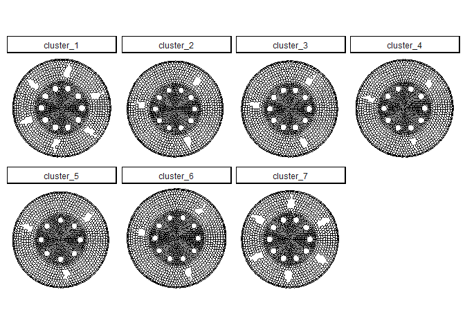
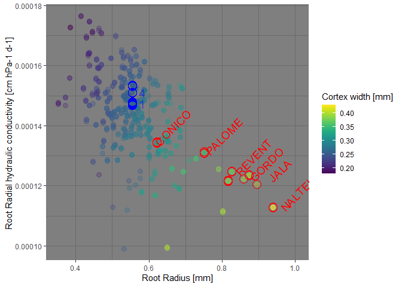
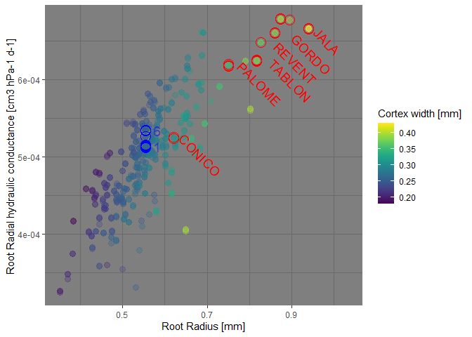

[](https://zenodo.org/doi/10.5281/zenodo.4316761)

Evidence that variation in root anatomy contributes to local adaptation
in Mexican native maize
================

Chloee M. McLaughlin, Meng Li, Melanie Perryman, Adrien Heymans, Hannah
Schneider, Jesse R. Lasky and Ruairidh J. H. Sawers

## GRANAR-MECHA: modeling pipeline to estimate emergent hydraulic properties”

### Used known model:

- The Generator of root anatomy in R - **GRANAR** [Heymans et
  al. 2020](https://doi.org/10.1104/pp.19.00617)
- The model of explicit hydraulic anatomy - **MECHA** [Couvreur et
  al. 2018](https://doi.org/10.1104/pp.18.01006)

## Run GRANAR to simulate cross-section anatomy from trait values

The Generator of root anatomy (GRANAR; Heymans et al. 2020) use a set of
input that can be derive from a few anatomical traits. The anatomical
traits needed to simulate root cross-section anatomy are:

| Anatomical parameter | Unit |
|----------------------|------|
| Root radius          | mm   |
| Stele radius         | mm   |
| Cortex file number   | \-   |
| Aerenchyma area      | mm^2 |
| Metaxylem area       | mm^2 |
| Nbr of metaxylem elm | \-   |

``` r
###### Proc for the generation of the anatomies
for(i in 1:nrow(Sampl)){
  # Set the input line
  tmp_sampl <- Sampl[i,]
  
  # clear results
  if(file.exists("./MECHA/cellsetdata/current_root.xml")){
    file.remove("./MECHA/cellsetdata/current_root.xml")
    file.remove("./MECHA/Projects/GRANAR/in/Maize_Geometry_aer.xml")
  }
  # Run GRANAR and change the parameter for the selected simulation
  sim <- run_granar(params, tmp_sampl)
  # Write the outputs
  file.copy("./MECHA/cellsetdata/current_root.xml", 
            paste0("./MECHA/cellsetdata/root_",i,".xml"), overwrite = T)
  file.copy("./MECHA/Projects/GRANAR/in/Maize_Geometry_aer.xml",
            paste0( "./MECHA/Projects/GRANAR/in/Maize_Geometry_aer_",i,".xml"), overwrite = T)
}
```

## CIMMyT cluster

The seven clusters of the CIMMyT panel are summarized here.

<!-- -->

## Run MECHA to estimate emergent hydraulic properties

The model of explicit cross-section hydraulic architecture (MECHA;
Couvreur et al. 2018) estimates kr from the root transverse anatomy
generated with GRANAR or CellSeT (Pound et al., 2012) and from the
subcellular scale hydraulic properties of walls, membranes, and
plasmodesmata.

| Sub-cell hydraulic properties   | Unit                 | Value   | Ref.                 |
|---------------------------------|----------------------|---------|----------------------|
| Cell wall conductivity          | $cm^2/hPa/d$         | 0.00024 | Zhu and Steudle 1991 |
| Cell membrane base permeability | $cm/hPa/d$           | 3e-5    | Ehlert et al. 2009   |
| Aquaporin contribution          | $cm/hPa/d$           | 0.00043 | Ehlert et al. 2009   |
| Conductance of plasmodesmata    | $cm^3/hPa/d/plasmo.$ | 5.3e-12 | Couvreur et al. 2018 |
| Cell wall thickness             | $µm$                 | 1.5     | Heymans et al. 2020  |

Three hydraulic scenario were implemeted for each simulation:

- 1.  Endodermal Casparian strip

- 2.  Endodermal suberization

- 3.  Endodermis full suberization and exodermal Casparian strip 

``` r
# ### Proc: estimation of the radial hydraulic conductivities
fls <- list.files("./MECHA/cellsetdata/")
fls <- fls[grepl("root_", fls)]
for(j in fls){
  message("--------------")
  print(j)
  message("--------------")

  if(file.exists("./MECHA/Projects/GRANAR/out/M1v4/Root/Project_Test/results/Macro_prop_1,0.txt")){
    file.remove("./MECHA/Projects/GRANAR/out/M1v4/Root/Project_Test/results/Macro_prop_1,0.txt")
    file.remove("./MECHA/Projects/GRANAR/out/M1v4/Root/Project_Test/results/Macro_prop_2,1.txt")
    file.remove("./MECHA/Projects/GRANAR/out/M1v4/Root/Project_Test/results/Macro_prop_4,2.txt")
    file.remove("./MECHA/cellsetdata/current_root.xml")
    file.remove("./MECHA/Projects/GRANAR/in/Maize_Geometry_aer.xml")
  }

  # Loading input files for the current estimation
  fc <- file.copy(paste0("./MECHA/cellsetdata/",j), "./MECHA/cellsetdata/current_root.xml", overwrite = T)
  if(fc == FALSE){next()}
  fc <- file.copy(paste0("./MECHA/Projects/GRANAR/in/Maize_Geometry_aer_", parse_number(j), ".xml"),
                  paste0("./MECHA/Projects/GRANAR/in/Maize_Geometry_aer.xml"), overwrite = T)
  if(fc == FALSE){next()}

  # MECHA input change
  id <- parse_number(j)
  microhydro(path = "MECHA/Projects/GRANAR/in/Maize_hydraulics.xml",
             kw = 0.00024,
             km = 3e-5,
             kAQP = 0.00043,
             kpl = 5.3e-12)

  wallthick(path = "MECHA/Projects/GRANAR/in/Maize_Geometry_aer.xml", 1.5)

  # Run MECHA - - - - - - -
  system("python3 ./MECHA/MECHAv4_septa.py")
  message("python script has ended")

  # if works well, then:
  if(file.exists("./MECHA/Projects/GRANAR/out/M1v4/Root/Project_Test/results/Macro_prop_1,0.txt")){
    # Save output
    message ("success")
    file.copy("./MECHA/Projects/GRANAR/out/M1v4/Root/Project_Test/results/Macro_prop_1,0.txt",
              paste0("./MECHA/Projects/GRANAR/out/M1v4/Root/Macro_prop_1,0_",id,".txt"), overwrite = T)
    file.copy("./MECHA/Projects/GRANAR/out/M1v4/Root/Project_Test/results/Macro_prop_2,1.txt",
              paste0("./MECHA/Projects/GRANAR/out/M1v4/Root/Macro_prop_2,1_",id,".txt"), overwrite = T)
    file.copy("./MECHA/Projects/GRANAR/out/M1v4/Root/Project_Test/results/Macro_prop_4,2.txt",
              paste0("./MECHA/Projects/GRANAR/out/M1v4/Root/Macro_prop_4,2_",id,".txt"), overwrite = T)
  }else{message ("fail and move to next simulation")}

}

# Read Mecha output
fls <- list.files("./MECHA/Projects/GRANAR/out/M1v4/Root/res/")
fls <- fls[grepl(".txt", fls)]

K <- tibble(kr = NULL, kx = NULL, sampl_id = NULL, apo = NULL)
for (k in fls){
  M <- read_file(paste0("./MECHA/Projects/GRANAR/out/M1v4/Root/res/",k))
  tmp_M <- strsplit(M, split="\n")[[1]]
  K_xyl_spec <- as.numeric(strsplit(tmp_M[15], " ")[[1]][5])
  kr_M <- as.numeric(strsplit(tmp_M[17], " ")[[1]][4])
  scenario <- round(parse_number(unlist(str_split(k,"_"))[3])/10)
  sampl_id <- parse_number(unlist(str_split(k,"_"))[4])
  K <- rbind(K, tibble(kr = kr_M, kx = K_xyl_spec, sampl_id = sampl_id, apo = scenario))
}
K = K %>%arrange(sampl_id, apo)

#### Merge the results on the input dataframe

# Axial hydraulic conductance (cm3 hPa-1 d-1)
Sampl$Kx[Sampl$id %in% K$sampl_id] = K$kx[K$apo == 1]

# Radial hydraulic conductivity (cm hPa-1 d-1)
Sampl$kr1_new[Sampl$id %in% K$sampl_id] = K$kr[K$apo == 1]
Sampl$kr2_new[Sampl$id %in% K$sampl_id] = K$kr[K$apo == 2]
Sampl$kr3_new[Sampl$id %in% K$sampl_id] = K$kr[K$apo == 4]

# Radial hydraulic conductance (cm3 hPa-1 d-1)
# Multiply by the surface of the segment (1 cm length * perimeter of the root)
Sampl$Kr1[Sampl$id %in% K$sampl_id] = K$kr[K$apo == 1]*2*pi*Sampl$radius[Sampl$id %in% K$sampl_id]
Sampl$Kr2[Sampl$id %in% K$sampl_id] = K$kr[K$apo == 2]*2*pi*Sampl$radius[Sampl$id %in% K$sampl_id]
Sampl$Kr3[Sampl$id %in% K$sampl_id] = K$kr[K$apo == 4]*2*pi*Sampl$radius[Sampl$id %in% K$sampl_id]
```

## Radial hydraulic conductance and conductivity

The emerging hydraulic properties are shown in the figures below to
highlight the radius effect and the one of the cortex width on the
radial hydraulic conductivity and conductance.

<!-- --><!-- -->
