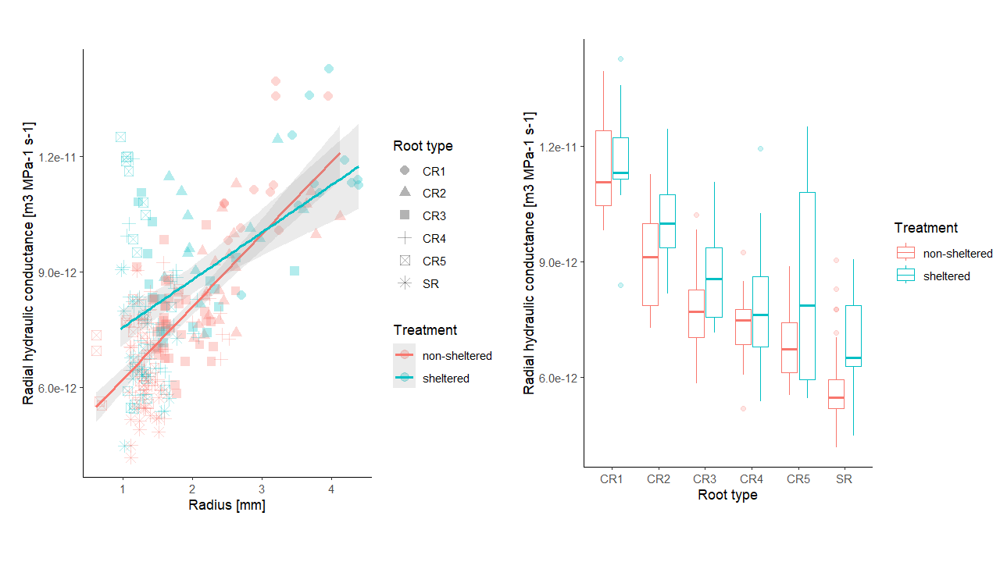
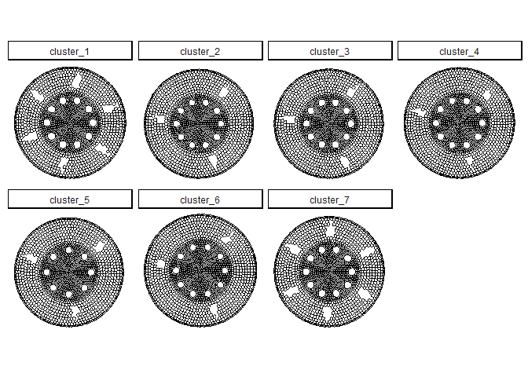
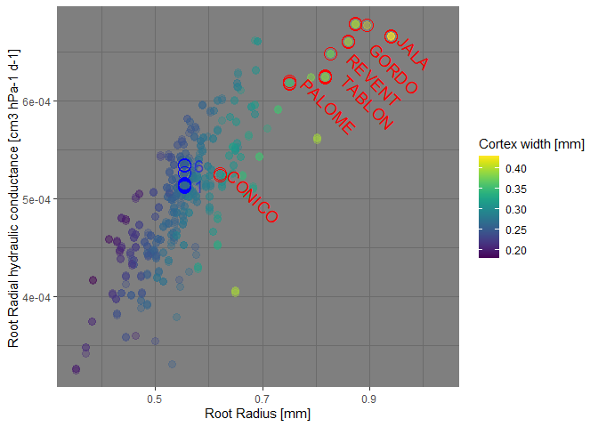

# GRANAR-MECHA: modeling pipeline to estimate emergent hydraulic properties
1.2.1 [](https://doi.org/10.5281/zenodo.14045758)

## 1. About

GRANAR-MECHA combines two models to estimate the emergent hydraulic properties of plant roots based on anatomical traits:

- **GRANAR**: The Generator of Root Anatomy in R ([Heymans et al. 2020](https://doi.org/10.1104/pp.19.00617)) for simulating root cross-sectional anatomy.
- **MECHA**: A model for Explicit Hydraulic Anatomy ([Couvreur et al. 2018](https://doi.org/10.1104/pp.18.01006)) for estimating radial hydraulic conductivity (kr) from root anatomy.

This pipeline enables the simulation of root anatomy and hydraulic properties under different anatomical and hydraulic scenarios.

## 2. Installation

To use this pipeline, clone the repository and set up the required environment.

```bash
git clone --branch Tina2024 https://github.com/HydraulicViper/RootDiversity.git
cd RootDiversity
```

### Requirements

- Python 3.7
- R 4.2

### From mamba/conda

>[!NOTE] 
> We recommend to use [Mamba](https://mamba.readthedocs.io/en/latest/installation/mamba-installation.html) to create a virtual environment and run the script in it ([Anaconda](https://www.anaconda.com/download) works also)
>
> For more information on how to set-up conda, please check the [conda user guide](https://conda.io/projects/conda/en/latest/user-guide/install)

```{bash}
mamba env create -f conda/environment.yaml
mamba activate mecha_env
```

## 3. Usage and Repository content

### 3.1 Run GRANAR

GRANAR simulates root cross-sectional anatomy using the following anatomical traits:

| Anatomical parameter | Unit |
|----------------------|------|
| Root radius          | mm   |
| Stele radius         | mm   |
| Cortex file number   | \-   |
| Aerenchyma area      | mm^2 |
| Metaxylem area       | mm^2 |
| Nbr of metaxylem elm | \-   |

```bash
Rscript ./src/main.R
```

Outputs include:

Geometry:  ```cellsetdata/root.xml``` and the needed compagnon file for MECHA ```Maize_Geometry_aer.xml```


### 3.2 Run MECHA

The MECHA estimates radial hydraulic conductivity from the root cross section anatomy generated with GRANAR or CellSeT (Pound et al., 2012) and from the subcellular scale hydraulic properties of walls, membranes, and plasmodesmata.

| Sub-cell hydraulic properties   | Unit                 | Value   | Ref.                 |
|---------------------------------|----------------------|---------|----------------------|
| Cell wall conductivity          | $cm^2/hPa/d$         | 0.00024 | Zhu and Steudle 1991 |
| Cell membrane base permeability | $cm/hPa/d$           | 3e-5    | Ehlert et al. 2009   |
| Aquaporin contribution          | $cm/hPa/d$           | 0.00043 | Ehlert et al. 2009   |
| Conductance of plasmodesmata    | $cm^3/hPa/d/plasmo.$ | 5.3e-12 | Couvreur et al. 2018 |
| Cell wall thickness             | $µm$                 | 1.5     | Heymans et al. 2020  |

Three hydraulic scenario were implemeted for each simulation:

1. Endodermal Casparian strip
2. Endodermal suberization
3. Endodermis full suberization and exodermal Casparian strip 

```bash
Rscript ./src/mecha_proc.R
```

### 3.3 Radial hydraulic conductance and conductivity analysis

The emerging hydraulic properties are shown in the figures below to
highlight the radius effect and the one of the cortex width on the
radial hydraulic conductivity and conductance.

## 4. Citation

If you are using GRANAR-MECHA coupling in a publised work, please cite: 

 > **Heymans A, Couvreur V, LaRue T, Paez-Garcia A, Lobet G** (2020) *GRANAR, a Computational Tool to Better Understand the Functional Importance of Monocotyledon Root Anatomy*. Plant Physiol 182: 707–720

 > **Couvreur V, Faget M, Lobet G, Javaux M, Chaumont F, Draye X** (2018) *Going with the Flow: Multiscale Insights into the Composite Nature of Water Transport in Roots*. Plant Physiol 178: 1689–1703

If you are using/modifying this repository for your analysis, please cite:

 > **McLaughlin CM, Li M, Perryman M, Heymans A, Schneider H, Lasky JR, Sawers RJH** (2024) *Evidence that variation in root anatomy contributes to local adaptation in Mexican native maize*. Evol Appl 17: e13673

and the latest pipeline version: RootDiversity v1.2.1 [](https://doi.org/10.5281/zenodo.14045758)

## 5. Branch history

This repository was originally branched for a paper:

Node order matters: comparative analysis of soil water limitation effects on root anatomy between nodal position and maize genotypes (Zea mays L.)
===============
Tina Koehler, Yunhee Kim, Shu-Yin Tung, Adrien Heymans, Nicolas Tyborski, Franziska Steiner, Andreas J. Wild, Johanna Pausch, Mutez A. Ahmed, Hannah Schneider

The initial branch was used in:

[Evidence that variation in root anatomy contributes to local adaptation
in Mexican native maize](https://doi.org/10.1111/eva.13673)
================
Chloee M. McLaughlin, Meng Li, Melanie Perryman, Adrien Heymans, Hannah Schneider, Jesse R. Lasky and Ruairidh J. H. Sawers


## 5. Some results:
Koehler et al. 

<!-- -->

This shows the link between root type and radial hydraulic conductance.
In addition, the relationship for root radius and radial hydrauli conductance. 

McLaughlin et al. 2024
<!-- -->
<!-- -->

## 6. License and Acknowledgments

This project is licensed under [GPL-3.0](./LICENSE). For more details, see [LICENSE](./LICENSE).
Lead development and coordination: Adrien Heymans.
Contributions from Chloee M. McLaughlin and Tina Koehler.

RootDiverity is a collaborative project and contributions are welcome. If you want to contribute, please contact the coordinator prior to any merge request.
